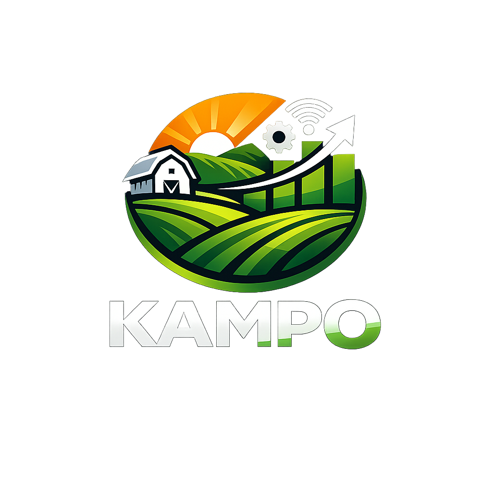
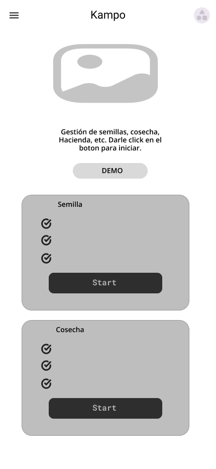
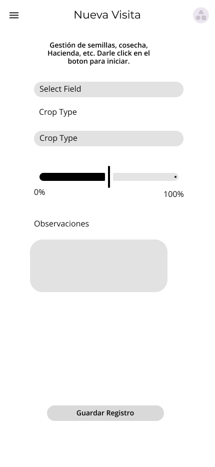
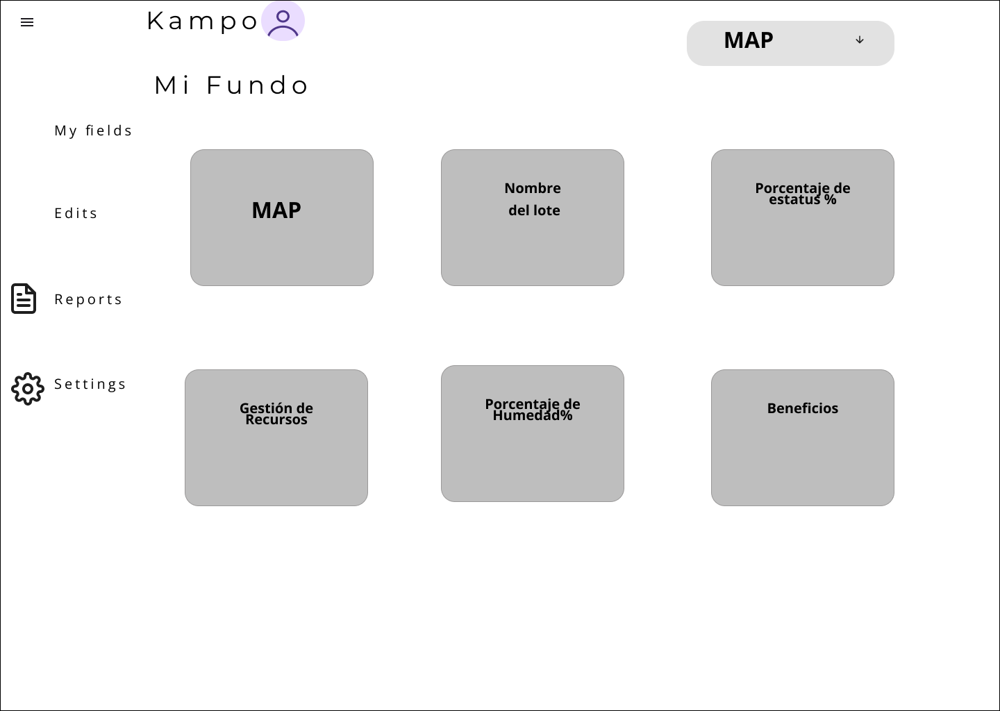
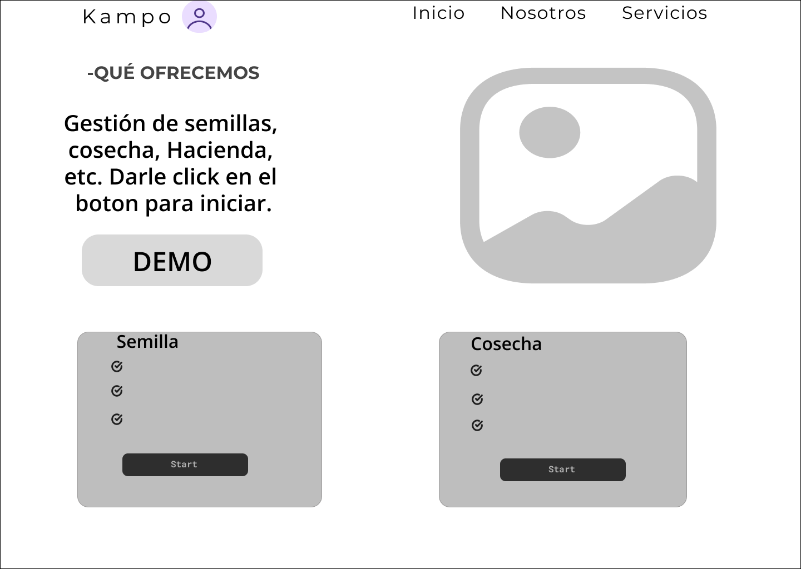
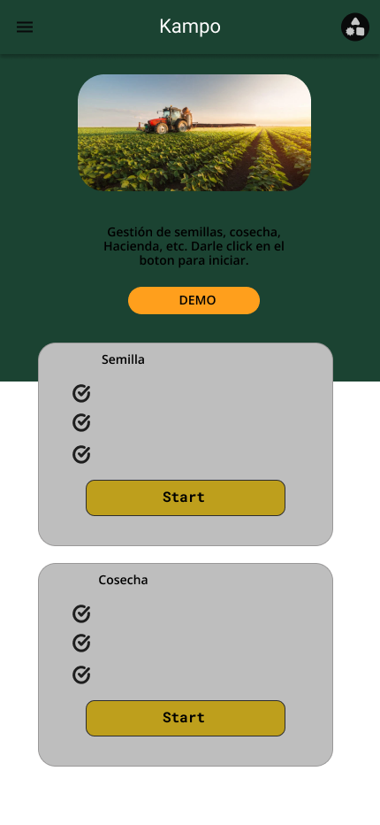
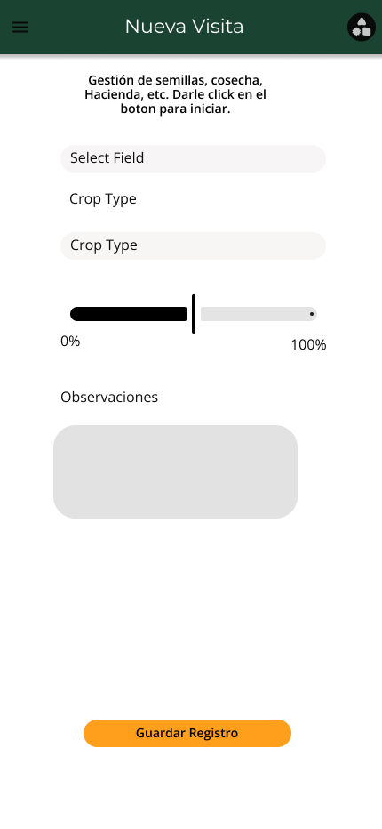
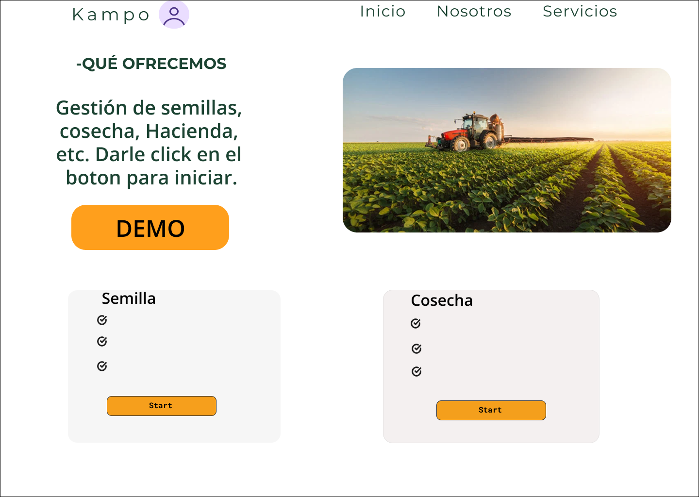
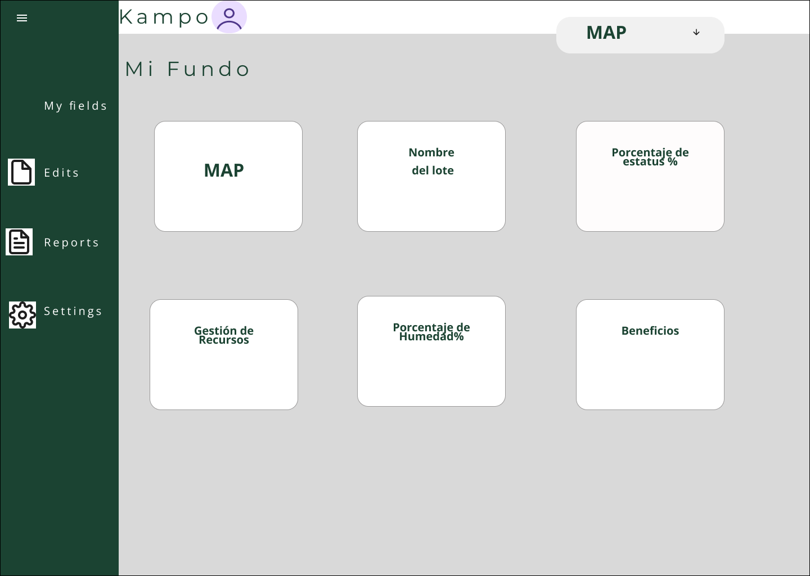

<h3>Universidad Peruana de Ciencias Aplicadas</h3>

 

<strong>Ingeniería de Software - 2026-01</strong> 
<strong>1ASI0729 - Desarrollo de Aplicaciones Open Source</strong> 
<strong>NRC: 11881</strong> 
<strong>Profesor: Efraín Ricardo Bautista Ubillús</strong> 

 <strong>Informe del Trabajo Final</strong>  

<strong>Startup: GreenSpot </strong> 
<strong>Producto: KAMPO</strong> 

### Team Members:

   Hurtado Balcazar Rommel Daniel     u202517474 

 Ramos Fuentes Rivera Adriana Nicole  u202018427 

 Tuesta Girón Kiara Lucia        u20251I477 

 Arroyo Gonzales Emily Juliette     u202311469 

 Acuache Lucas Mathias Joaquin     u202314898 

<strong>26 de Abril de 2026</strong> 

# Registro de Versiones del Informe

**TB1**

| Versión | Fecha      | Autor               | Descripción de modificación                                                                     |
|---------|------------|---------------------|-------------------------------------------------------------------------------------------------|

**TP**

| Versión | Fecha       | Autor               | Descripción de modificación                                       |
|---------|-------------|---------------------|-------------------------------------------------------------------|

**TB2**

| Versión | Fecha      | Autor               | Descripción de modificación                                                                |
|---------|------------|---------------------|--------------------------------------------------------------------------------------------|

**TF**

| Versión | Fecha      | Autor               | Descripción de modificación                                                                                                           |
|---------|------------|---------------------|---------------------------------------------------------------------------------------------------------------------------------------|

# Project Report Collaboration Insights

**TB1**

**TP**

**TB2**

**TF**

**TB1**

**TP1**

**TB2**

**TF**

# Contenido

- [Student Outcome](#student-outcome)
- [Capítulo I: Introducción](#capítulo-i-introducción)
    - [1.1. Startup Profile](#11-startup-profile)
        - [1.1.1. Descripción de la Startup](#111-descripción-de-la-startup)
        - [1.1.2. Perfiles de integrantes del equipo](#112-perfiles-de-integrantes-del-equipo)
    - [1.2. Solution Profile](#12-solution-profile)
        - [1.2.1. Antecedentes y problemática](#121-antecedentes-y-problemática)
        - [1.2.2. Lean UX Process](#122-lean-ux-process)
            - [1.2.2.1. Lean UX Problem Statements](#1221-lean-ux-problem-statements)
            - [1.2.2.2. Lean UX Assumptions](#1222-lean-ux-assumptions)
            - [1.2.2.3. Lean UX Hypothesis Statements](#1223-lean-ux-hypothesis-statements)
            - [1.2.2.4. Lean UX Canvas](#1224-lean-ux-canvas)
    - [1.3. Segmentos objetivo](#13-segmentos-objetivo)
- [Capítulo II: Requirements Elicitation & Analysis](#capítulo-ii-requirements-elicitation--analysis)
    - [2.1. Competidores](#21-competidores)
        - [2.1.1. Análisis competitivo](#211-análisis-competitivo)
        - [2.1.2. Estrategias y tácticas frente a competidores](#212-estrategias-y-tácticas-frente-a-competidores)
    - [2.2. Entrevistas](#22-entrevistas)
        - [2.2.1. Diseño de entrevistas](#221-diseño-de-entrevistas)
        - [2.2.2. Registro de entrevistas](#222-registro-de-entrevistas)
        - [2.2.3. Análisis de entrevistas](#223-análisis-de-entrevistas)
    - [2.3. Needfinding](#23-needfinding)
        - [2.3.1. User Personas](#231-user-personas)
        - [2.3.2. User Task Matrix](#232-user-task-matrix)
        - [2.3.3. User Journey Mapping](#233-user-journey-mapping)
        - [2.3.4. Empathy Mapping](#234-empathy-mapping)
    - [2.4. Big Picture Event Storming](#24-big-picture-event-storming)
    - [2.5. Ubiquitous Language](#25-ubiquitous-language)
- [Capítulo III: Requirements Specification](#capítulo-iii-requirements-specification)
    - [3.1. User Stories](#31-user-stories)
    - [3.2. Impact Mapping](#32-impact-mapping)
    - [3.3. Product Backlog](#33-product-backlog)
- [Capítulo IV: Product Design](#capítulo-iv-product-design)
    - [4.1. Style Guidelines](#41-style-guidelines)
        - [4.1.1. General Style Guidelines](#411-general-style-guidelines)
        - [4.1.2. Web Style Guidelines](#412-web-style-guidelines)
    - [4.2. Information Architecture](#42-information-architecture)
        - [4.2.1. Organization Systems](#421-organization-systems)
        - [4.2.2. Labeling Systems](#422-labeling-systems)
        - [4.2.3. SEO Tags and Meta Tags](#423-seo-tags-and-meta-tags)
        - [4.2.4. Searching Systems](#424-searching-systems)
        - [4.2.5. Navigation Systems](#425-navigation-systems)
    - [4.3. Landing Page UI Design](#43-landing-page-ui-design)
        - [4.3.1. Landing Page Wireframe](#431-landing-page-wireframe)
        - [4.3.2. Landing Page Mock-up](#432-landing-page-mock-up)
    - [4.4. Web Applications UX/UI Design](#44-web-applications-uxui-design)
        - [4.4.1. Web Applications Wireframes](#441-web-applications-wireframes)
        - [4.4.2. Web Applications Wireflow Diagrams](#442-web-applications-wireflow-diagrams)
        - [4.4.3. Web Applications Mock-ups](#443-web-applications-mock-ups)
        - [4.4.3. Web Applications User Flow Diagrams](#443-web-applications-user-flow-diagrams)
    - [4.5. Web Applications Prototyping](#45-web-applications-prototyping)
    - [4.6. Domain-Driven Software Architecture](#46-domain-driven-software-architecture)
        - [4.6.1. Design-Level Event Storming](#461-design-level-event-storming)
        - [4.6.2. Software Architecture Context Diagram](#462-software-architecture-context-diagram)
        - [4.6.3. Software Architecture Container Diagrams](#463-software-architecture-container-diagrams)
        - [4.6.4. Software Architecture Components Diagrams](#464-software-architecture-components-diagrams)
    - [4.7. Software Object-Oriented Design](#47-software-object-oriented-design)
        - [4.7.1. Class Diagrams](#471-class-diagrams)
    - [4.8. Database Design](#48-database-design)
        - [4.8.1. Database Diagrams](#481-database-diagrams)
- [Capítulo V: Product Implementation, Validation & Deployment](#capítulo-v-product-implementation-validation--deployment)
    - [5.1. Software Configuration Management](#51-software-configuration-management)
        - [5.1.1. Software Development Environment Configuration](#511-software-development-environment-configuration)
        - [5.1.2. Source Code Management](#512-source-code-management)
        - [5.1.3. Source Code Style Guide & Conventions](#513-source-code-style-guide--conventions)
        - [5.1.4. Software Deployment Configuration](#514-software-deployment-configuration)
    - [5.2. Landing Page, Services & Applications Implementation](#52-landing-page-services--applications-implementation)
        - [5.2.1. Sprint 1](#521-sprint-1)
            - [5.2.1.1. Sprint Planning 1](#5211-sprint-planning-1)
            - [5.2.1.2. Aspect Leaders and Collaborators](#5212-aspect-leaders-and-collaborators)
            - [5.2.1.3. Sprint Backlog 1](#5213-sprint-backlog-1)
            - [5.2.1.4. Development Evidence for Sprint Review](#5214-development-evidence-for-sprint-review)
            - [5.2.1.5. Execution Evidence for Sprint Review](#5215-execution-evidence-for-sprint-review)
            - [5.2.1.6. Services Documentation Evidence for Sprint Review](#5216-services-documentation-evidence-for-sprint-review)
            - [5.2.1.7. Software Deployment Evidence for Sprint Review](#5217-software-deployment-evidence-for-sprint-review)
            - [5.2.1.8. Team Collaboration Insights during Sprint](#5218-team-collaboration-insights-during-sprint)
        - [5.2.2. Sprint 2](#522-sprint-2)
            - [5.2.2.1. Sprint Planning 2.](#5221-sprint-planning-2)
            - [5.2.2.2. Aspect Leaders and Collaborators.](#5222-aspect-leaders-and-collaborators)
            - [5.2.2.3. Sprint Backlog 2.](#5223-sprint-backlog-2)
            - [5.2.2.4. Development Evidence for Sprint Review.](#5224-development-evidence-for-sprint-review)
            - [5.2.2.5. Execution Evidence for Sprint Review.](#5225-execution-evidence-for-sprint-review)
            - [5.2.2.6. Services Documentation Evidence for Sprint Review.](#5226-services-documentation-evidence-for-sprint-review)
            - [5.2.2.7. Software Deployment Evidence for Sprint Review.](#5227-software-deployment-evidence-for-sprint-review)
            - [5.2.2.8. Team Collaboration Insights during Sprint.](#5228-team-collaboration-insights-during-sprint)
        - [5.2.3. Sprint 3](#523-sprint-3)
            - [5.2.3.1. Sprint Planning 3](#5231-sprint-planning-3)
            - [5.2.3.2. Aspect Leaders and Collaborators](#5232-aspect-leaders-and-collaborators)
            - [5.2.3.3. Sprint Backlog 3](#5233-sprint-backlog-3)
            - [5.2.3.4. Development Evidence for Sprint Review](#5234-development-evidence-for-sprint-review)
            - [5.2.3.5. Execution Evidence for Sprint Review](#5235-execution-evidence-for-sprint-review)
            - [5.2.3.6. Services Documentation Evidence for Sprint Review](#5236-services-documentation-evidence-for-sprint-review)
            - [5.2.3.7. Software Deployment Evidence for Sprint Review](#5237-software-deployment-evidence-for-sprint-review)
            - [5.2.3.8. Team Collaboration Insights during Sprint](#5238-team-collaboration-insights-during-sprint)
        - [5.2.4. Sprint 4](#524-sprint-4)
            - [5.2.4.1. Sprint Planning 4](#5241-sprint-planning-4)
            - [5.2.4.2. Aspect Leaders and Collaborators](#5242-aspect-leaders-and-collaborators)
            - [5.2.4.3. Sprint Backlog 4](#5243-sprint-backlog-4)
            - [5.2.4.4. Development Evidence for Sprint Review](#5244-development-evidence-for-sprint-review)
            - [5.2.4.5. Execution Evidence for Sprint Review](#5245-execution-evidence-for-sprint-review)
            - [5.2.4.6. Services Documentation Evidence for Sprint Review](#5246-services-documentation-evidence-for-sprint-review)
            - [5.2.4.7. Software Deployment Evidence for Sprint Review](#5247-software-deployment-evidence-for-sprint-review)
            - [5.2.4.8. Team Collaboration Insights during Sprint](#5248-team-collaboration-insights-during-sprint)
    - [5.3. Validation Interviews](#53-validation-interviews)
        - [5.3.1. Diseño de entrevistas](#531-diseño-de-entrevistas)
        - [5.3.2. Registro de entrevistas](#532-registro-de-entrevistas)
        - [5.3.3. Evaluaciones según heurísticas](#533-evaluaciones-según-heurísticas)
- [5.4. Video About the Product](#54-video-about-the-product)

- [Conclusiones](#conclusiones)
- [Bibliografía](#bibliografía)
- [Anexos](#anexos)

---

# Student Outcome

### Capítulo I: Introducción
#### 1.1. Startup Profile
##### 1.1.1. Descripción de la Startup

##### 1.1.2. Perfiles de integrantes del equipo

|                               Miembro                               |                                                                                                                                                                                                                                                                                                                                                                                                                                                                                 Descripción                                                                                                                                                                                                                                                                                                                                                                                                                                                                                 |
|:-------------------------------------------------------------------:|:---------------------------------------------------------------------------------------------------------------------------------------------------------------------------------------------------------------------------------------------------------------------------------------------------------------------------------------------------------------------------------------------------------------------------------------------------------------------------------------------------------------------------------------------------------------------------------------------------------------------------------------------------------------------------------------------------------------------------------------------------------------------------------------------------------------------------------------------------------------------------------------------------------------------------------------------------------------------------:|
|    | **Hurtado Balcazar Rommel Daniel  \- U202517474**    Soy Rommel Hurtado Balcázar, tengo 23 años y estudio Ingeniería de Software en el 5to-6to ciclo. Me considero un líder técnico orientado a la resolución de problemas, con capacidad para tomar decisiones y guiar al equipo hacia los objetivos del proyecto. Cuento con experiencia en desarrollo fullstack, manejando tanto frontend como backend. En el lado del servidor trabajo principalmente con Java, y en el frontend utilizo React. Además, tengo conocimientos en bases de datos relacionales con SQL y no relacionales con MongoDB, así como experiencia con Node.js, Python y HTML/CSS. He desarrollado proyectos propios fuera del ámbito universitario, lo que me ha dado una visión completa del ciclo de desarrollo de software. También me desenvuelvo en inglés a nivel intermedio-avanzado, lo que me permite acceder a documentación técnica y comunicarme en entornos internacionales. |
|   |                                                                   **Ramos Fuentes Rivera Adriana Nicole \- U202018427**   Soy Adriana Nicole Ramos Fuentes Rivera, estudio la carrera de Ingeniería de Software en la UPC, actualmente estoy en el 5to ciclo. Me gusta aprender nuevas tecnologias y conocimientos complementarios que me permitan desarrollar soluciones a problematicas dentro de un contexto real. Cuento con experiencia en lenguajes de programación como C++ y Python, además de conocimientos en base de datos no relacional como MongoDB. Dentro del equipo, me enfoco en el desarrollo de frontend y backend, aplicando principios de Domain Driven Design para mantener una lógica de negocio clara y el modelo de arquitectura C4, para documentar la arquitectura de sistemas de software de una manera clara y jerárquica. Me considero una persona organizada y empática                                                                   |
|     |                                                                                                                                                                                                                                                                                                       **Tuesta Girón Kiara Lucia \- U20251I477**   Soy estudiante de Ingeniería de Software, tengo 20 años y me interesa el desarrollo de aplicaciones. He trabajado con lenguajes como C++ y C#, y también tengo experiencia usando SQL para bases de datos. En trabajos en equipo me gusta participar activamente, aportar ideas y ayudar a que el grupo avance.                                                                                                                                                                                                                                                                                                       |
|     |                                                                                                                                                                                                                                                                                                                                            **Arroyo Gonzales Emily Juliette \- U202311469**      Soy estudiante de la carrera de Ingeniería de Software, tengo 20 años, tengo experiencia en lenguajes como C++, MongoDB, en trabajos grupales me gusta aportar ideas que contribuyan a mi grupo y avanzar según lo asignado.                                                                                                                                                                                                                                                                                                                                            |
|  |                                                                                                                                                                                                                                                                                     **Acuache Lucas Mathias Joaquin \- U202314898**    Soy Mathias Joaquin Acuache Lucas, me encuentro en el sexto ciclo de la carrera de ingeniería de software, mi código de alumno es u202314898. Tengo experiencia en C++, SQL, MongoDB, además de utilizar GitHub de manera correcta. Me considero una persona que trata de apoyar en los diversos trabajos en equipo e investigo cosas nuevas.                                                                                                                                                                                                                                                                                     |                                                                          

#### 1.2. Solution Profile
##### 1.2.1. Antecedentes y problemática

###### Antecedentes

###### Problemática

##### 1.2.2. Lean UX Process
###### 1.2.2.1. Lean UX Problem Statements
En el sector agrícola peruano, el pequeño y mediano productor (que gestiona entre 3 y 50 hectáreas) opera en un entorno de alta incertidumbre y falta de herramientas técnicas. 
A diferencia de las grandes agroexportadoras que utilizan tecnología de precisión, el agricultor tradicional toma decisiones críticas basadas en la intuición o experiencias pasadas.
¿Cómo podríamos facilitar que estos productores accedan a datos técnicos de su campo sin que puedan tener una inversión inalcanzable?

Hemos observado que la gestión del riego es uno de los puntos más críticos. Actualmente, gran parte de los agricultores riega bajo un calendario fijo o por simple observación, 
lo que genera un desperdicio de agua de hasta el 45%. Esto reduce la calidad del producto final e impide que se venda a un precio competitivo. Ante esto, surge la interrogante:
¿Existe una forma de proporcionar indicadores precisos sobre el clima y la calidad del suelo para asegurar una cosecha óptima?

Por otro lado, la administración financiera de las parcelas suele llevarse de forma manual en cuadernos o registros informales. Esto impide que el agricultor conozca con precisión
la rentabilidad por cada campaña, lo cual es vital dado que la agricultura se rige por temporadas. No contabilizar adecuadamente los costos genera un desconocimiento crítico sobre
la inversión en insumos y mano de obra. ¿De qué manera podríamos ayudar a los agricultores a que puedan gestionar sus costos y conocer su rentabilidad real?

Finalmente, factores externos  como el cambio climático y el alza de precios en fertilizantes obligan a los productores a ser más eficientes que nunca. Sin embargo, la información 
técnica sobre el estado de sus cultivos tarda en ser procesada o simplemente no existe, esto impide que el agricultor llegue a tomar decisiones a ciegas y no pueda gestionar de una 
manera rentable su cultivo. ¿De qué manera podríamos ayudar a los agricultores a que puedan gestionar su cosecha de manera rentable?

###### 1.2.2.2. Lean UX Assumptions
#### A. BUSINESS OUTCOMES
Para que nuestro software pueda tener un mejor resultado, hemos realizado diversas suposiciones para validar el uso de la aplicación:

* **Reducción de Abandono:** Mantener una tasa de abandono menor al 10% mensual, asegurando que el agricultor pueda gestionar sus datos con nuestra app luego de probarlo
* gratuitamente.
* **Crecimiento Orgánico:** Conseguir que cada usuario activo refiera al menos a más agricultores de su misma zona o asociación, reduciendo el costo de adquisición de clientes en
* regiones rurales, de esta manera la aplicación crecerá de manera exponencial en el rubro de la agricultura.
* **Escalabilidad del Dominio:** Validar que el modelo de "Campaña y Lote" funcione tanto para cultivos de costa como de la sierra, permitiendo tener una expansión por todo el Perú.
* **Reducción de Pérdidas:** Disminuir en un 25% las pérdidas de cultivos reportadas por los usuarios gracias a la anticipación mediante alertas técnicas.

#### B. USERS OUTCOMES
Vamos a asumir diversos supuestos del cliente para que de esta manera tener una validación en la aplicación a realizar.

* **¿Quién es el cliente?**
  Pequeños y medianos agricultores peruanos ubicados en las regiones del Perú, que poseen smartphones pero carecen de herramientas digitales especializadas para el campo.
* **¿Dónde encaja nuestro producto en su vida?**
  Como una herramienta de consulta diaria en la parcela para la toma de decisiones técnicas y como libro digital para operaciones financieras.
* **¿Qué problemas soluciona nuestro producto?**
  Elimina la incertidumbre sobre el riego, previene la pérdida de cultivos por falta de datos técnicos y ambientales y ayuda a la gestión financiera de los usuarios.
* **¿Cuándo y cómo se utiliza nuestro producto?**
  Diariamente para monitorear el estado del suelo y clima, y de manera frecuente para el control de gastos operativos.
* **¿Qué características son importantes?**
  Alertas preventivas de riego/clima, registro simplificado de ingresos y egresos, historial de campañas, etc.
* **¿Cómo deberían verse y comportarse nuestro producto?**
  Con una interfaz amigable, iconos con fácil visibilidad, legibles, que pueda ser fácil el uso para los agricultores y que tengan un rendimiento bueno.

  
###### 1.2.2.3. Lean UX Hypothesis Statements
* **Hipótesis 1:**
**Creemos que** al proporcionar un sistema de alertas de riego basado en sensores de humedad y clima para los pequeños y medianos agricultores, lograremos que reduzcan el
desperdicio de agua en un 20% y mejoren la calidad de su cosecha. **Sabremos que tenemos razón cuando** los registros de riego en la plataforma muestren resultados en comparación a
como antes el usuarios desperdiciaba agua en sus cultivos.

* **Hipótesis 2:**
**Creemos que** al implementar un módulo de registro simplificado de ingresos y egresos por campaña para los productores, lograremos que el agricultor identifique su utilidad neta
en tiempo real y tome mejores decisiones de inversión, además de tener una ayuda interna con la aplicación para dichas decisiones. **Sabremos que tenemos razón cuando** el 60% de
los usuarios activos logren completar el flujo financiero total de su cosecha dentro de la aplicación.

###### 1.2.2.4. Lean UX Canvas

#### 1.3. Segmentos objetivo

## Capítulo II: Requirements Elicitation & Analysis
## 2.1. Competidores

    Agrisoft es una empresa peruana centrada en la gestión administrativa y financiera del sector agroindustrial, la cual ofrece un sistema ERP completo que permite controlar costos por hectárea, manejar planillas, gestionar almacenes, llevar trazabilidad de cosechas y facturar electrónicamente integrado con SUNAT. Asimismo, algunas de sus funcionalidades son el registro detallado de insumos, maquinaria y mano de obra, la generación de reportes financieros por cultivo o temporada, y el control de stock y compras. Por último, este sistema está enfocado en grandes agroexportadoras, cooperativas agrícolas de tamaño mediano a grande y empresas del agro peruano que requieren un control contable riguroso.

 

    Agricolum es una plataforma internacional de origen español que combina el cuaderno de campo digital con la gestión operativa y financiera de una explotación agrícola. Además, permite registrar tareas y tratamientos fitosanitarios, controlar costos por cultivo, gestionar mano de obra, generar trazabilidad obligatoria para normativas europeas y exportar informes regulatorios, y sus funcionalidades incluyen la planificación de cosechas, el control de inventario de insumos, el registro de jornales y la generación automática de reportes para certificaciones. Finalmente, esta plataforma está enfocada en empresas de servicios agrícolas, cooperativas y asesores agrónomos que necesitan cumplir con exigencias legales de trazabilidad y cuaderno de campo digital.

 

    Prismab es una solución especializada en el monitoreo técnico del riego, con un fuerte enfoque en la eficiencia hídrica y la reducción del consumo de agua, por esta razón, utiliza sensores inalámbricos que miden humedad del suelo y salinidad, enviando datos en tiempo real a una plataforma digital. También incluye funcionalidades como alertas automáticas por condiciones críticas, reportes históricos de consumo de agua, recomendaciones precisas para optimizar el riego e integración con sistemas de riego automatizado. En resumen, Prismab está enfocada en agricultores que ya utilizan o desean implementar riego tecnificado, especialmente en zonas con estrés hídrico, y en cultivos de alto valor.

##### 2.1.1. Análisis competitivo

    El análisis competitivo implica examinar detenidamente a nuestros competidores para identificar sus fortalezas, debilidades, oportunidades y amenazas. Esto nos proporcionará una visión clara de nuestro posicionamiento en el mercado y nos ayudará a desarrollar estrategias efectivas.

 
<table>
  <tr>
    <th colspan="7" valign="top"><b>Competitive Analysis Landscape</b></th>
  </tr>
  <tr>
    <td colspan="2" rowspan="2">¿Por qué llevar a cabo este análisis?</td>
    <td colspan="5">Escriba en el recuadro la pregunta que busca responder o el objetivo de este análisis.</td>
  </tr>
  <tr>
    <td colspan="5">El análisis competitivo es fundamental para entender el entorno en el que KAMPO opera, identificar las fortalezas y debilidades de los competidores, y descubrir oportunidades y amenazas en el mercado. Este análisis ayuda a posicionar mejor nuestra startup en relación con los competidores y a definir estrategias que maximicen nuestra ventaja competitiva.</td>
  </tr>
  <tr>
    <td colspan="3">Nombre y Logo</td>
    <td colspan="1" valign="top" style="font-weight: bold;">
        KAMPO
         
        

                </img>
        

    <td colspan="1" valign="top" style="font-weight: bold;">
    Agrisoft
    

                </img>
        

    </td>
    <td colspan="1" valign="top" style="font-weight: bold;">
      Agricolum
      

                </img>
            

      </td>
    <td colspan="1" valign="top" style="font-weight: bold;" >
      Prismab
      

                </img>
            

    </td>
  </tr>
  <tr>
    <td colspan="1" rowspan="2">
Perfil
</td>
    <td colspan="2">Overview</td>
    <td colspan="1" valign="top">Plataforma web y móvil enfocada en ingenieros agrónomos y fundos peruanos. Combina control de cultivos, rentabilidad e inventario, con la opción de escalar a servicios IoT.</td>
    <td colspan="1" valign="top">ERP agrícola robusto para agroexportadoras y fundos grandes. Muy orientado a costos, almacenes, planillas y logística.</td>
    <td colspan="1" valign="top">App agrícola enfocada en cuaderno de campo, trazabilidad, GPS y cumplimiento normativo.</td>
    <td colspan="1" valign="top">Solución orientada a trazabilidad agrícola, packing y control operativo de empresas agroexportadoras.</td>
  </tr>
  <tr>
    <td colspan="2">Ventaja competitiva¿Qué valor ofrece a los clientes?</td>
    <td colspan="1" valign="top">Capacidad de traducir la gestión del cultivo en decisiones financieras simples, integrando en una sola plataforma el control operativo, el uso de recursos y la rentabilidad, mediante una experiencia accesible y adaptada a los usuarios.</td>
    <td colspan="1" valign="top">Tiene amplia experiencia, módulos empresariales y fuerte control financiero.</td>
    <td colspan="1" valign="top">Es muy fuerte en trazabilidad y facilidad de uso móvil.</td>
    <td colspan="1" valign="top">Está especializado en trazabilidad y operaciones agroindustriales.</td>
  </tr>
  <tr>
    <td colspan="1" rowspan="2">
Perfil de Marketing
</td>
    <td colspan="2">Mercado objetivo</td>
    <td colspan="1" valign="top">Ingenieros agrónomos y fundos peruanos.</td>
    <td colspan="1" valign="top">Agroexportadoras, fundos medianos y grandes, empresas con procesos complejos.</td>
    <td colspan="1" valign="top">Agricultores, cooperativas y asesores agrícolas.</td>
    <td colspan="1" valign="top">Empresas agrícolas y exportadoras medianas/grandes.</td>
  </tr>
  <tr>
    <td colspan="2">Estrategias de marketing</td>
    <td colspan="1" valign="top">Venta directa, alianzas con ingerieros agrónomos, cooperativas, y fundos.</td>
    <td colspan="1" valign="top">Ventas consultivas, demos empresariales, referencias y soporte especializado.</td>
    <td colspan="1" valign="top">Marketing digital, prueba gratuita y enfoque en cumplimiento normativo.</td>
    <td colspan="1" valign="top">B2B, relaciones comerciales y proyectos a medida.</td>
  </tr>
  <tr>
    <td colspan="1" rowspan="3">
Perfil de Producto
</td>
    <td colspan="2">Productos & Servicios</td>
    <td colspan="1" valign="top">Registro de parcelas y cultivos, gastos, cosechas, stock de insumos, rentabilidad, dashboard y alertas.</td>
    <td colspan="1" valign="top">Costos de producción, almacenes, planillas, maquinaria, logística y tesorería.</td>
    <td colspan="1" valign="top">Cuaderno de campo digital, GPS, trazabilidad, gestión de cultivos y reportes.</td>
    <td colspan="1" valign="top">Trazabilidad, control de procesos, producción y gestión agrícola.</td>
  </tr>
  <tr>
    <td colspan="2">Precios & Costos</td>
    <td colspan="1" valign="top">La primera membresía basica cuesta S/.20 mensual, la membresia intermedia cuesta S/.45 mensual y la membresia premium cuesta S/.95 mensual.</td>
    <td colspan="1" valign="top">El costo depende del tamaño de la operación y los módulos requeridos.</td>
    <td colspan="1" valign="top">La primera membresía es gratuita, la segunda cuesta 168€ al año y la tercera, 336€ al año</td>
    <td colspan="1" valign="top">No tiene membresías. Vende productos IoT (sensores, transmisores, etc.)</td>
  </tr>
  <tr>
    <td colspan="2">Canales de distribución (Web y/o Móvil)</td>
    <td colspan="1" valign="top">Web y móvil.</td>
    <td colspan="1" valign="top">Web.</td>
    <td colspan="1" valign="top">Web y móvil.</td>
    <td colspan="1" valign="top">Web.</td>
  </tr>
  <tr>
    <td colspan="1" rowspan="5">
Análisis SWOT
</td>
    <td colspan="6">Realice esto para su startup y sus competidores. Sus fortalezas deberían apoyar sus oportunidades y contribuir a lo que ustedes definen como su posible ventaja competitiva.</td>
  </tr>
  <tr>
    <td colspan="2">Fortalezas</td>
    <td colspan="1" valign="top">Capacidad de integrar la gestión del cultivo con el análisis de rentabilidad.</td>
    <td colspan="1" valign="top">Muy completo, experiencia de mercado y soporte sólido.</td>
    <td colspan="1" valign="top">Interfaz sencilla, gran adopción y fuerte trazabilidad.</td>
    <td colspan="1" valign="top">Conocimiento del sector agroindustrial y trazabilidad.</td>
  </tr>
  <tr>
    <td colspan="2">Debilidades</td>
    <td colspan="1" valign="top">No cuenta con funcionalidades avanzadas o una marca posicionada.</td>
    <td colspan="1" valign="top">Complejo, caro y poco atractivo para fundos.</td>
    <td colspan="1" valign="top">Menor enfoque financiero y de rentabilidad.</td>
    <td colspan="1" valign="top">Menos orientado a fundos y menor simplicidad.</td>
  </tr>
  <tr>
    <td colspan="2">Oportunidades</td>
    <td colspan="1" valign="top">Gran cantidad de ingenieros agrónomos y fundos peruanos que todavía gestionan sus actividades en papel o Excel.</td>
    <td colspan="1" valign="top">Expandirse hacia agricultura de precisión e IoT.</td>
    <td colspan="1" valign="top">Agregar más analítica financiera.</td>
    <td colspan="1" valign="top">Aprovechar la digitalización del sector exportador.</td>
  </tr>
  <tr>
    <td colspan="2">Amenazas</td>
    <td colspan="1" valign="top">Apps o ERPs existentes puedan replicar sus funcionalidades básicas o lanzar versiones simplificadas.</td>
    <td colspan="1" valign="top">Plataformas más simples, económicas y rápidas de implementar.</td>
    <td colspan="1" valign="top">Pierde relevancia frente a soluciones que implementan automatización, analítica y recomendaciones inteligentes basadas en datos.</td>
    <td colspan="1" valign="top">Depende principalmente de empresas agroindustriales grandes y limita su escalabilidad hacia segmentos más amplios.</td>
  </tr>
</table>

##### 2.1.2. Estrategias y tácticas frente a competidores

#### Estrategias:

- Posicionar a KAMPO como una alternativa práctica y económica, diseñada específicamente para agricultores que no cuentan con las herramientas digitales necesarias.

- Permitir que el usuario empiece con funciones básicas y, a medida que gana confianza, pueda acceder a herramientas más avanzadas sin complicaciones.

- Reducir la barrera de adopción tecnológica mediante una experiencia simple y clara, adaptada al contexto rural y al nivel digital del usuario.

- Construir una propuesta de valor basada en el uso de datos simples y útiles, que permitan al agricultor tomar decisiones rápidas sin necesidad de conocimientos técnicos avanzados.

- Diferenciarse al integrar en una sola plataforma el manejo del cultivo y el control de la rentabilidad, brindando una visión completa del negocio agrícola.

#### Tácticas:

- Implementar tutoriales interactivos y soporte dentro de la plataforma que acompañen al usuario en sus primeros usos.

- Incorporar dashboards simples y alertas automáticas que conviertan los datos en acciones concretas para el agricultor.

- Conectar el registro de cultivos con el análisis de costos y rentabilidad para ofrecer información en tiempo real.

- Mostrar el valor de la plataforma mediante demostraciones en campo y contenido práctico en redes sociales.

- Generar alianzas con agrónomos, asociaciones y cooperativas para impulsar la adopción y fortalecer la confianza en la herramienta.

## 2.2. Entrevistas
##### 2.2.1. Diseño de entrevistas

##### 2.2.2. Registro de entrevistas

##### 2.2.3. Análisis de entrevistas
 

## 2.3. Needfinding
##### 2.3.1. User Personas
<<<<<<< HEAD
=======
Las User Personas representan arquetipos construidos a partir de la información recopilada en las entrevistas realizadas a los segmentos objetivo, complementadas con el análisis del contexto del sector agrícola. Estas permiten sintetizar comportamientos, necesidades y problemáticas comunes, facilitando la toma de decisiones en el diseño de soluciones centradas en el usuario.
En este caso, se elaboraron dos User Personas correspondientes a los segmentos identificados: ingenieros agrónomos asesores y actores del sector agroindustrial. Las características incluidas en cada perfil se derivan directamente de los patrones observados en las entrevistas, tales como el uso de herramientas no especializadas, la falta de monitoreo en tiempo real y la necesidad de centralización de información

USER PERSONA 01- Ingeniero agrónomo asesor

  
   

USER PERSONA 02 - Agroindustria mediana y grande

  

>>>>>>> d0efd1d5801a2299addc682027924d72cebb5b62
##### 2.3.2. User Task Matrix
##### 2.3.3. User Journey Mapping
<<<<<<< HEAD
##### 2.3.4. Empathy Mapping
=======
SEGMENTO 01

  
   

SEGMENTO 02

  
   

##### 2.3.4. Empathy Mapping
El Empathy Mapping permite comprender de manera integral a los usuarios, identificando sus pensamientos, emociones, acciones y entorno. A partir de este análisis, se identifican los principales pains y gains, los cuales permiten detectar oportunidades de mejora y orientar el diseño de la solución propuesta.

USER PERSONA 01

  
   

USER PERSONA 02

  
   

>>>>>>> d0efd1d5801a2299addc682027924d72cebb5b62
## 2.4. Big Picture Event Storming

    Empleamos la técnica de Big Picture Event para que, a través del modelado, se pueda explorar y comprender el dominio del negocio identificando eventos clave, actores y sus interacciones. Además, nos brinda una visión global del funcionamiento del sistema, facilitando la detección de procesos, relaciones y posibles problemáticas dentro del negocio.

 

    En consecuencia, al aplicar esta herramienta, nos ayudo a comprender el dominio del negocio de gestión de fundos dentro del sector agrícola y su funcionamiento general, brindando el contexto donde se desarrolla nuestra solución, Kampo.

 

    A continuación, se siguieron tres pasos esenciales para elaborar el Big Picture Event Storming:

 

**Paso 1: Generar los eventos de dominio**

    En esta etapa, se identifican los eventos relevantes del dominio del negocio, los cuales nos permiten tener una visión inicial del funcionamiento del negocio.

 

 

**Paso 2: Ordenar los eventos del dominio**

    En esta etapa, se organizan los eventos cronológicamente, mejorando la visualización del flujo de los procesos del negocio. Además, facilita la comprensión de cómo se desarrollan las operaciones y cómo se relacionan los distintos eventos entre sí.

 

 

**Paso 3: Agregando actores y sistemas externos**

    Por ultimo, se adicionan los actores y sistemas externos que interactúan con el dominio, permitiendo identificar quienes participan y qué herramientas o medios intervienen.

 

## 2.5. Ubiquitous Language

    Empleamos el Ubiquitous Language como un conjunto de términos y conceptos compartidos que nos permiten establecer una comunicación clara y consistente entre todos los miembros del equipo. Además, se construye a partir del dominio del negocio y busca eliminar ambigüedades en la interpretación de los procesos y entidades involucradas.

 

Dentro de Kampo, nuestro contexto, se han definido los siguientes términos clave, los cuales, están definidos en inglés, incluyendo su equivalente en español, y sus definiciones permiten alinear el entendimiento del dominio entre todos los participantes del proyecto.

 

  <ul>
    <li>Rustic property (Fundo): Unidad productiva completa que agrupa uno o varios lotes.</li>
    <li>Field (Lote): Subdivisión del fundo donde se gestiona un cultivo específico.</li>
    <li>Crop (Cultivo): Tipo de planta sembrada en un lote durante una campaña.</li>
    <li>Input (Insumo): Recurso, material y materia prima que se utiliza en el proceso productivo.</li>
    <li>Stock: Cantidad de productos.</li>
    <li>Season (Temporada): Periodo productivo de un cultivo en un lote.</li>
    <li>Field visit (Visita de campo): Evento en el que un ingeniero inspecciona un lote en una fecha específica.</li>
    <li>Observation (Observación): Registro del estado general del cultivo durante una visita.</li>
    <li>Pest (Plaga): Organismo visible que daña el cultivo.</li>
    <li>Disease (Enfermedad): Alteración del cultivo causada por patógenos (hongos, bacterias, virus).</li>
    <li>Severity (Severidad): Nivel de impacto de una plaga o enfermedad en el cultivo.</li>
    <li>Treatment application (Aplicación de insumo): Uso de productos (fertilizantes, pesticidas, etc.) en el cultivo.</li>
    <li>Recommendation (Recomendación): Acción sugerida tras una evaluación.</li>
    <li>Weather condition (Condición climática): Datos del clima en un momento específico.</li>
    <li>Weather alert (Alerta climática): Notificación generada por condiciones climáticas riesgosas.</li>
    <li>Historical data (Historial): Conjunto de registros organizados en el tiempo.</li>
    <li>Report (Reporte): Documento generado automáticamente con información técnica.</li>
  </ul> 

---

## Capítulo III: Requirements Specification
## 3.1. User Stories

#### US11- Visualización de Historial de Cultivos

**Relacionado con:** EP01

**Descripción:** Como usuario, quiero visualizar el historial de cultivos para analizar información previa.

**Criterios de Aceptación:**

**Escenario 1: Consulta de historial**

Dado que existen registros históricos

Cuando el usuario selecciona un cultivo

Entonces el sistema muestra la información pasada.

**Escenario 2: Sin historial disponible**

Dado que no existen registros

Cuando el usuario consulta el historial

Entonces el sistema indica que no hay información disponible.

#### US12 - Registro Offline en Campo

**Relacionado con: EP02**

**Descripción:** Como supervisor de campo, quiero registrar información sin conexión para no perder datos en zonas sin internet.

**Criterios de Aceptación:**

**Escenario 1: Registro sin conexión**

Dado que el usuario no tiene conexión a internet

Cuando registra información de cultivo

Entonces el sistema guarda los datos localmente.

**Escenario 2: Sincronización posterior**

Dado que el dispositivo recupera conexión

Cuando el usuario accede al sistema

Entonces los datos se sincronizan automáticamente.

#### US13 - Seguimiento del Estado del Cultivo

**Relacionado con:** EP02

**Descripción:** Como ingeniero agrónomo, quiero visualizar el estado actual del cultivo para evaluar su condición.

**Criterios de Aceptación:**

**Escenario 1: Visualización de estado**

Dado que existen datos recientes del cultivo

Cuando el usuario accede al lote

Entonces el sistema muestra el estado actual del cultivo.

**Escenario 2: Falta de datos recientes**

Dado que no hay información actualizada

Cuando el usuario consulta el estado

Entonces el sistema indica que no hay datos recientes.

#### US14 - Registro de Condiciones Climáticas Manuales

**Relacionado con: EP02**

**Descripción:** Como supervisor, quiero registrar condiciones climáticas manualmente para complementar la información del cultivo.

**Criterios de Aceptación:**

**Escenario 1: Registro manual**

Dado que el usuario ingresa datos climáticos

Cuando completa los campos requeridos

Entonces el sistema registra la información correctamente.

**Escenario 2: Validación de datos**

Dado que el usuario ingresa datos incompletos

Cuando intenta guardar

Entonces el sistema rechaza el registro.

#### US15 - Gestión de Actividades por Prioridad

**Relacionado con:** EP05

**Descripción:** Como supervisor, quiero priorizar actividades para optimizar la ejecución en campo.

**Criterios de Aceptación:**

**Escenario 1: Asignación de prioridad**

Dado que el usuario registra una actividad

Cuando selecciona un nivel de prioridad

Entonces el sistema la clasifica correctamente.

**Escenario 2: Orden de actividades**

Dado que existen múltiples actividades

Cuando el usuario consulta la lista

Entonces el sistema las ordena por prioridad.

#### EP05 - Gestión de Actividades Agrícolas

#### US16 - Acceso Rápido a Información Crítica

**Relacionado con:** EP02

**Descripción:** Como ingeniero agrónomo, quiero acceder rápidamente a información crítica para tomar decisiones oportunas.

**Criterios de Aceptación:**

**Escenario 1: Visualización rápida**

Dado que el usuario accede al sistema

Cuando ingresa al dashboard

Entonces visualiza información clave de forma inmediata.

**Escenario 2: Falta de datos**

Dado que no hay información relevante disponible

Cuando el usuario accede

Entonces el sistema muestra un estado vacío.

#### US17 - Dashboard Ejecutivo Consolidado

**Relacionado con:** EP02

**Descripción:** Como gerente agrícola, quiero visualizar un dashboard consolidado para tener una visión general de toda la operación.

**Criterios de Aceptación:**

**Escenario 1: Visualización general**

Dado que existen datos registrados en múltiples módulos

Cuando el usuario accede al dashboard

Entonces el sistema muestra indicadores clave (estado de cultivos, alertas, actividades).

**Escenario 2: Sin datos suficientes**

Dado que no hay información registrada

Cuando el usuario accede

Entonces el sistema muestra un estado vacío informativo.

#### US18 - Detección de Anomalías en Cultivo

**Relacionado con:** EP02

**Descripción:** Como ingeniero agrónomo, quiero detectar cambios anómalos en variables del cultivo para prevenir problemas.

**Criterios de Aceptación:**

**Escenario 1: Detección automática**

Dado que existen registros históricos

Cuando el sistema detecta una variación fuera de lo normal

Entonces genera una alerta.

**Escenario 2: Sin anomalías**

Dado que los valores están dentro del rango esperado

Cuando el sistema analiza los datos

Entonces no genera alertas.

#### US19 - Asignación de Responsables por Lote

**Relacionado con:** EP01

**Descripción:** Como gerente agrícola, quiero asignar responsables a cada lote para mejorar la organización del trabajo.

**Criterios de Aceptación:**

**Escenario 1: Asignación exitosa**

Dado que existen usuarios registrados

Cuando el gerente asigna un responsable a un lote

Entonces el sistema guarda la asignación.

**Escenario 2: Reasignación**

Dado que un lote ya tiene responsable

Cuando el gerente asigna uno nuevo

Entonces el sistema actualiza la información.

#### US20 - Notificación de Retrasos en Actividades

**Relacionado con:** EP05

**Descripción:** Como gerente agrícola, quiero recibir notificaciones de retrasos para tomar acciones correctivas.

**Criterios de Aceptación:**

**Escenario 1: Detección de retraso**

Dado que una actividad tiene fecha límite

Cuando no se completa a tiempo

Entonces el sistema genera una alerta.

**Escenario 2: Actividad completada a tiempo**

Dado que la actividad se ejecuta correctamente

Cuando se revisa el estado

Entonces no se genera alerta.

## 3.2. Impact Mapping

Para esta sección se ha realizado la creación del Impact Mapping de KAMPO, basado en los objetivos del negocio para los ingenieros agrónomos. Se definen los impactos esperados, los entregables necesarios y su relación con las historias de usuario.

#### Impact Mapping - Ingeniero agrónomo asesor

[Ver Imagen](https://raw.githubusercontent.com/GreenSpot-app/Kampo-Report/refs/heads/feature/sprint1-emily/assets/img/Impact%20Mapping/Impact%20Mapping.png)

## 3.3. Product Backlog

---

## Capítulo IV: Product Design
## 4.1. Style Guidelines
##### 4.1.1. General Style Guidelines

Las Decisiones de Estilo de Kampo se basan en la necesidad de poder transmitir una cierta confianza, cercanía y profesionalismo en el contexto de la gestión de campos para pequeños y medianos agricultores. Se busca una interfaz clara, accesible y consistente, que pueda facilitar la interacción que tengan nuestros segmentos usuarios al momento de ayudarlos en sus diversos objetivos.

Branding
El branding de KAMPO no es solo estética; es una declaración de intenciones. El nombre, con la sustitución de la "C" por la "K", denota una evolución tecnológica del campo tradicional.

* Isotipo: El logotipo integra surcos de siembra en perspectiva con una flecha de crecimiento ascendente y ondas de señal inalámbrica (IoT). Esto comunica que el campo no solo crece, sino que se comunica y se optimiza.
* Identidad Visual: Se aleja de los verdes pasteles para usar verdes profundos y saturados que representan la salud de un cultivo maduro, contrastados con el naranja del sol y las alertas críticas

## Tipografía

| Tipo | Fuente | Uso | Razón |
| :--- | :--- | :--- | :--- |
| **Display/Heading** | Montserrat | Títulos y métricas clave | Transmite solidez y autoridad en los reportes. |
| **Body** | Open Sans | Texto de contenido y tablas | Optimizada para lectura en pantallas móviles bajo condiciones de alta luminosidad solar. |
| **Monospace** | JetBrains Mono | Datos de sensores e ID de lotes | Facilita la lectura de coordenadas y valores numéricos precisos sin errores de interpretación. |

## Colors

| Nombre | Hex | Uso |
| :--- | :--- | :--- |
| Agro Primary | `#1B4332` | Marca, Sidebar y Títulos |
| Harvest Gold | `#FF9F1C` | Botones de acción y Alertas |
| Soil Neutral | `#E9ECEF` | Fondos de aplicación |
| Critical Red | `#D00000` | Alertas de plagas o estrés hídrico |

La paleta busca generar una experiencia visual equilibrada, transmitiendo seguridad, limpieza y accesibilidad.

Spacing:

El sistema de espaciado de KAMPO se basa en una unidad base de 8px, siguiendo buenas prácticas de diseño UI modernas.

Se utilizan múltiplos de esta unidad para mantener consistencia:

8px → separación mínima
16px → separación estándar
24px / 32px → separación entre secciones
48px → separación de bloques principales

Lo que se quiere transmitir con todo esto es poder generar una confianza a los usuarios los cuales van a utilizar esta app y que ellos puedan interactuar de una manera positiva.

##### 4.1.2. Web Style Guidelines

Las Web Style Guidelines de KAMPO establecen los estándares de diseño de interfaz (UI) y experiencia de usuario (UX) específicos para nuestra plataforma. Estas guías aseguran que la herramienta sea funcional bajo condiciones extremas de uso, como alta luminosidad solar, conectividad intermitente y el uso de dispositivos móviles en movimiento.

Diseño Responsive:

La aplicación se adapta a los siguientes dispositivos:

* Desktop
* Mobile
* Tablet

Componentes Críticos del Sistema de Diseño:

Los componentes del sistema de KAMPO han sido diseñados bajo principios de robustez, eficiencia y escalabilidad

* **Navbar & Sidebar:** En la Landing Page, se utiliza una Navbar superior fija para acceso rápido a "Planes" y "Nosotros". En la Web App, se implementa una Sidebar colapsable que prioriza el espacio para los mapas y gráficos, permitiendo navegar entre "Mis Fundos", "Reportes" y "Finanzas".
* **Action Buttons:** Diseñados con bordes redondeados (8px) y un tamaño mínimo de 48px para facilitar el uso táctil en campo.
    * **Primary:** Color Verde Agro (#1B4332) para acciones de guardado y registro de visitas.
    * **Secondary:** Color Naranja Harvest (#FF9F1C) para alertas de riego o llamadas a la acción crítica.
* **Hero Section:** Ubicada al inicio de la Landing Page, presenta un mensaje de alto impacto sobre la digitalización del agro peruano, acompañado de una imagen de alta resolución que evoca profesionalismo y un botón de "Comenzar Prueba Gratis".
* **Data-Driven Cards:** Componente central de la interfaz. Se utilizan para mostrar el resumen de cada lote. Incluyen un indicador de color semántico y métricas clave como humedad y temperatura, permitiendo una lectura rápida sin entrar al detalle.
* **Field Forms:** Inputs optimizados para la entrada de datos en movimiento. Utilizan Steppers para cantidades de fertilizantes y Sliders para niveles de severidad de plagas, reduciendo la necesidad de usar el teclado virtual del celular.
* **Status Badges:** Pequeños elementos visuales que indican la etapa actual del cultivo (Siembra, Crecimiento, Cosecha) o el estado de sincronización de los datos IoT (Sincronizado / Pendiente).
* **Icons:** Set de iconos minimalistas y reconocibles basados en el sector: una gota para riego, un brote para cultivo, un billete para finanzas y un sensor para datos IoT.

### Estándares de Interacción
Para garantizar que el usuario sepa que su acción fue registrada en entornos de distracción se implementan:

* **Micro-interacciones de Confirmación:** Los botones de guardado cambian a un estado de "Cargando" y luego a un "Check" verde mediante transiciones suaves de 300ms, proporcionando certeza visual.
* **Skeleton Screens:** Durante la carga de datos de sensores IoT, se muestran estructuras grises que imitan el contenido final, reduciendo la percepción de tiempo de espera y la ansiedad del usuario.
* **Haptic Feedback (Mobile):** El uso de vibraciones ligeras al detectar una "Alerta Crítica" para captar la atención del usuario sin necesidad de que esté mirando la pantalla constantemente.

## 4.2. Information Architecture

En KAMPO, la arquitectura de información ha sido diseñada para que el usuario tenga una buena interacción. Se diferencia estratégicamente la experiencia del Landing Page (orientada a la persuasión y conversión de agrónomos y empresas) de la Web Application (orientada a la eficiencia operativa y toma de decisiones técnicas). El objetivo primordial es minimizar la carga cognitiva, permitiendo que el usuario acceda a datos críticos de sensores o registros financieros con la menor cantidad de interacciones posibles. 

##### 4.2.1. Organization Systems

### Sistema de Organización
El sistema de organización se ha estructurado de tres formas distintas según el contexto de uso:

* **Organización Jerárquica (Visual Hierarchy):** Se aplica en el Dashboard principal. La información fluye de lo macro a lo micro: **Fundo > Sector > Lote > Planta**. Esto permite que un gerente agrícola pueda ver el estado general de su empresa y descender hasta el detalle de un sensor específico.
* **Organización Secuencial (Step-by-Step):** Utilizada para procesos críticos como el "Registro de Visita de Campo" y el "Cierre de Campaña Financiera". Estos flujos guían al usuario paso a paso para asegurar que no se omitan datos técnicos (como severidad de plagas) ni contables (como costos de insumos).
* **Esquema de Categorización por Tópicos:** Dentro de la ficha de cada lote, la información se agrupa por temas: **Monitoreo Técnico** (clima y suelo), **Gestión de Insumos** (fertilizantes) y **Cronograma** (etapas del cultivo).

##### 4.2.2. Labeling Systems

Se ha implementado un sistema de la siguiente manera:

| Etiqueta | Descripción del contenido |
| :--- | :--- |
| **Mis Fundos** | Panel central que agrupa todas las unidades productivas del usuario. |
| **Bitácora** | Historial cronológico de observaciones, fotos y notas tomadas en campo. |
| **Alertas** | Notificaciones automáticas de estrés hídrico o anomalías climáticas. |
| **Campaña** | Sección para la gestión financiera y técnica de un ciclo de cultivo específico. |
| **Lote** | Vista detallada de una subdivisión específica del fundo con datos de sensores. |

##### 4.2.3. SEO Tags and Meta Tags

**Landing Page**

* **Title:** KAMPO | Gestión Agrícola Inteligente e IoT en Perú
* **Description:** Digitaliza tu fundo con KAMPO. Monitoreo de cultivos por sensores y control de rentabilidad para ingenieros agrónomos y pequeños productores.
* **Keywords:** agricultura digital perú, software agrónomos, riego inteligente iot, gestión de fundos, rentabilidad agrícola.
* **Author:** GreenSpot-app

**Web Application**

* **Title:** Dashboard KAMPO | Panel de Control Agrícola
* **Description:** Sistema de gestión operativa: registro de visitas, alertas técnicas y análisis de costos en tiempo real.
* **Keywords:** dashboard agrícola, monitoreo iot, reporte de plagas, control de cosecha.

##### 4.2.4. Searching Systems

El sistema de búsqueda está diseñado para manejar grandes volúmenes de datos históricos y múltiples parcelas:

* **Búsqueda Predictiva:** En el Dashboard, el usuario puede buscar por nombre de **Fundo** o **Lote**, obteniendo sugerencias inmediatas mientras escribe.
* **Filtros de Estado:** En la sección de reportes, se incluyen filtros avanzados por **Fecha**, **Tipo de Cultivo** y **Nivel de Severidad** de plagas detectadas.
* **Búsqueda por Atributos:** Permite localizar rápidamente lotes que se encuentren en una etapa específica (ej. *"Lotes en Cosecha"*) para optimizar la logística del personal.

##### 4.2.5. Navigation Systems

Se han definido tres niveles de navegación para asegurar que el usuario nunca se sienta perdido:

* **Navegación Estructural:** Una barra lateral persistente en la Web App con iconos reconocibles que permiten saltar entre las funciones principales.
* **Navegación de Contexto:** Indicadores de ruta (breadcrumbs) que permiten al usuario retroceder niveles jerárquicos fácilmente.
* **Navegación de Utilidad:** Ubicada en la parte superior derecha, incluye el perfil del ingeniero, configuración de sensores y acceso directo a notificaciones de alerta crítica.

## 4.3. Landing Page UI Design
##### 4.3.1. Landing Page Wireframe
El wireframe de la Landing Page se diseñó con un enfoque en la jerarquía de información. Se utilizó una estructura de una sola página (Single Page) para facilitar la navegación del usuario.

* **Hero Section:** Ubicada en la parte superior para captar la atención inmediata con la propuesta de valor.

* **Sección de Membresías:** Presentada en una cuadrícula de tres columnas, donde se destaca visualmente el plan "Cosecha" para incentivar la conversión hacia el plan intermedio.

* **Navegación:** Un menú superior fijo (Sticky Navbar) que permite el acceso rápido a las secciones de beneficios y precios.

##### 4.3.2. Landing Page Mock-up

El mock-up aplica la identidad visual de la marca utilizando la paleta de colores Verde Agro (#1B4332) y Naranja Harvest (#FF9F1C).

* **Contraste:** Se garantizó un contraste elevado entre el texto blanco y el fondo verde para asegurar la legibilidad.

* **Componentes:** Se utilizaron botones con bordes redondeados (8px) y estados visuales (hover) para mejorar la interactividad.

* **Imágenes:** Se incluyeron fotografías de alta resolución del sector agrícola peruano para generar cercanía y confianza con el usuario final.

## 4.4. Web Applications UX/UI Design

##### 4.4.1. Web Applications Wireframes
Los wireframes de la aplicación web se dividieron en dos vistas principales para cubrir las necesidades tanto en oficina como en campo:

* **Dashboard (Desktop):** Utiliza un sistema de sidebar para navegación lateral y Data-Cards para mostrar el resumen de los lotes.

* **Registro de Visita (Mobile):** Diseñado bajo el principio de "Thumb-Driven Design", ubicando los controles principales en la zona de fácil acceso para el pulgar. Se reemplazó el teclado por sliders y dropdowns para agilizar el registro bajo la luz del sol.

##### 4.4.2. Web Applications Wireflow Diagrams
El usuario puede manejar las diversas opciones que tiene cuando entra en su fundo, de esta manera se tiene un flujo centrandose en todo lo que puede realizar de manera autonoma, por lo cual es una manera interactiva de poder realizar esto.

##### 4.4.3. Web Applications Mock-ups

Los mock-ups finales integran el Color System semántico de KAMPO:

* **Semáforos de Estado:** Uso de Rojo (Crítico), Naranja (Alerta) y Verde (Óptimo) en las tarjetas de datos para permitir un escaneo visual rápido de más de 10 lotes simultáneamente.

* **Accesibilidad:** Se respetó el tamaño de los elementos táctiles (Target Size 48x48px) en la versión móvil, asegurando que la aplicación sea usable incluso con manos húmedas o en movimiento.

##### 4.4.4. Web Applications User Flow Diagrams
Para validar la experiencia de usuario (UX), se desarrolló un prototipo funcional e interactivo en Figma. Este prototipo permite simular el flujo real de un ingeniero agrónomo, desde la recepción de una alerta hídrica hasta el registro de una inspección en campo. Se implementaron transiciones de tipo 'Smart Animate' para representar de forma fluida el despliegue de menús laterales y el movimiento de los sliders de severidad, garantizando que la navegación sea intuitiva y eficiente.

## 4.5. Web Applications Prototyping
## 4.6. Domain-Driven Software Architecture
##### 4.6.1. Design-Level Event Storming

    En esta sección se explica y evidencia el uso de Design-Level EventStorming, que nos sirvió para plantear una aproximación revisada y mejorada al modelado de nivel general para el dominio del problema.

 

**Step 1: Unstructured Exploration**

    En este paso, se realizó una lluvia de ideas de los eventos del dominio.

 

**Step 2: Timelines**

    En el segundo paso, el equipo ordeno los eventos de dominio según el orden que ocurren en el dominio empresarial.

 

**Step 3: Pain Points**

    En el tercer paso, el equipo colocó dudas sobre el dominio o documentación faltante en algunas partes del flujo que ya había sido ordenado anteriormente.

 

**Step 4: Pivotal Points**

    En el cuarto paso, el equipo buscó eventos comerciales importantes que indiquen un cambio en el contexto y los marcó con una línea.

 

**Step 5: Commands**

    En este quinto paso, el equipo añadió comandos que desencadenen eventos o el flujo de eventos, junto a sus actores.

 

**Step 6: Policies**

    En este sexto paso, el equipo añadió policies, que son reglas de negocio que hace que se ejecuten comandos sin la necesidad de un actor.

 

**Step 7: Read Models**

    En este séptimo paso, el equipo añadió read models, que son como la vista de datos que el usuario usa para tomar la decisión de ejecutar un comando.

 

**Step 8: External Systems**

    En este octavo paso, el equipo identifico sistemas externos, en este caso solo se tiene uno que es la API que usaremos para el consumo de datos climáticos.

 

**Step 9: Aggregates**

    En este noveno paso, el equipo antes de agregar los agregados, discutió bastantes cosas sobre pasos anteriores y se decidió hacer algunos cambios en los read models, policies, eventos y commands.

 

**Step 10: Bounded Contexts**

    En el último paso, es buscar agregados que estén relacionados entre sí mediante policies para luego identificar bounded contexts y finalmente enmarco los eventos de dominio que fueron implementados.

##### 4.6.2. Software Architecture Context Diagram
<did align="justify">
    Kampo es una plataforma digital diseñada para optimizar la gestión agrícola, se tiene dos segmentos objetivos principales, el ingeniero agrónomo quien utiliza la plataforma para gestionar parcelas, asignar tareas y generar reportes, mientras que el agricultor  de agroindustria mediana o grande se enfoca en ejecutar las labores asignadas y registrar datos fenológicos y ambientales. Además la aplicación intercambia datos con servicios externos para obtener información climática en tiempo real.

##### 4.6.3. Software Architecture Container Diagrams
##### 4.6.4. Software Architecture Components Diagrams
## 4.7. Software Object-Oriented Design
##### 4.7.1. Class Diagrams
## 4.8. Database Design
##### 4.8.1. Database Diagrams

---

## Capítulo V: Product Implementation, Validation & Deployment
## 5.1. Software Configuration Management
##### 5.1.1. Software Development Environment Configuration

##### 5.1.2. Source Code Management

### Tipos permitidos:

##### 5.1.3. Source Code Style Guide & Conventions

##### 5.1.4. Software Deployment Configuration

## 5.2. Landing Page, Services & Applications Implementation
##### 5.2.X. Sprint n
###### 5.2.X.1. Sprint Planning n
###### 5.2.1.2. Aspect Leaders and Collaborators
###### 5.2.X.3. Sprint Backlog n
###### 5.2.X.4. Development Evidence for Sprint Review
###### 5.2.X.5. Execution Evidence for Sprint Review
###### 5.2.X.6. Services Documentation Evidence for Sprint Review
###### 5.2.X.7. Software Deployment Evidence for Sprint Review
###### 5.2.X.8. Team Collaboration Insights during Sprint
## 5.3. Validation Interviews
##### 5.3.1. Diseño de Entrevistas
##### 5.3.2. Registro de Entrevistas
##### 5.3.3. Evaluaciones según heurísticas
## 5.4. Video About-the-Product

## Conclusiones
#### Conclusiones y recomendaciones
#### Video About-the-Team

## Bibliografía

<<<<<<< HEAD
=======
Business Empresarial. (2024). *Perú enfrenta rezagos de tecnificación en el agro: Solo el 20% de su superficie agrícola cuenta con riego tecnificado*. https://www.businessempresarial.com.pe/peru-enfrenta-rezagos-de-tecnificacion-en-el-agro-solo-el-20-de-su-superficie-agricola-cuenta-con-riego-tecnificado-2/

Centro Nacional de Planeamiento Estratégico. (s.f.). *Agricultura 4.0: La revolución tecnológica transformará el futuro del cultivo y la producción alimentaria*.CEPLAN - Plataforma del Estado Peruano.https://www.gob.pe/institucion/ceplan/noticias/822019-agricultura-4-0-la-revolucion-tecnologica-transformara-el-futuro-del-cultivo-y-la-produccion-limentaria

Corporación ADAMA Perú. (2025, agosto 20). *Tecnología en el agro: Los softwares agrícolas que están revolucionando la producción*.https://www.adama.com/peru/es/noticias/tecnologia-en-el-agro-los-softwares-agricolas-que-estan-revolucionando-la-produccion

Ernst & Young Perú. (2025, diciembre 22). *¿Cómo le va al agro en el Perú?*EY Insights.https://www.ey.com/es_pe/insights/revista-execution/tendencias/agro-en-peru

Ministerio de Desarrollo Agrario y Riego. (s.f.). *Problemas en la agricultura peruana*. MIDAGRI.https://www.midagri.gob.pe/portal/22-sector-agrario/vision-general/190-problemas-en-la-agricultura-peruana

Pizarro Valladares, J. F. (2022, octubre 18). *Tecnología, la clave para el impulso de la agricultura peruana 4.0*. Conexión ESAN.https://www.esan.edu.pe/conexion-esan/tecnologia-la-clave-para-el-impulso-de-la-agricultura-peruana-4-0

Redacción Infobae Perú. (2025, octubre 25). *Agricultura inteligente: Un puente entre la justicia hídrica y la sostenibilidad empresarial en el Perú*. Infobae.https://www.infobae.com/peru/2025/10/25/agricultura-inteligente-un-puente-entre-la-justicia-hidrica-y-la-sostenibilidad-empresarial-en-el-peru

>>>>>>> d0efd1d5801a2299addc682027924d72cebb5b62
## Anexos

